# Windows Installation

KUBAM can be used to deploy Windows. We support

* Windows 2012 R2
* Windows 2016

At this time KUBAM requires a decent amount of manual steps to install Windows.  We are working to make this easier but we still hope this method sucks less than other installers that you are using.  

# Windows Server 2016

To install Windows Server 2016, we will use unattended instalation feature. That will give us zero-touch deployment. We will use original Windows Server 2016 instalation iso in combination with "answer file". To prepare and create answer file (__autounattend.xml__) we are using __Windows System Image Manager (SIM)__ tool from __Windows Assessment and Deployment Kit (ADK)__. Preparation of the answer file should be done on Windows workstation or server. Answer file will be packed into .img file and mounted as additional drive in UCS vMedia Policy.

## Download and install latest Windows ADK

Windows ADK can be downloaded from [Microsoft website](https://docs.microsoft.com/en-us/windows-hardware/get-started/adk-install).


After ADK is downloaded we will start installation on the local machine. We just need to install Deployment Tools feature which consist Windows System Image Manager.


## Creating "answer file" (autounattend.xml)

To be able to generate answer file, we need to copy content of Windows Server 2016 instalation image (.iso) to some folder on our workstation (or server). We can mount it to virtual optical drive, or extract it using archiver. In this example we are using [Windows Server 2016 Evaluation](https://www.microsoft.com/en-us/evalcenter/evaluate-windows-server-2016) (14393.0.161119-1705.RS1\_REFRESH\_SERVER\_EVAL\_X64FRE\_EN-US.ISO), and unpacking ith with archiver.

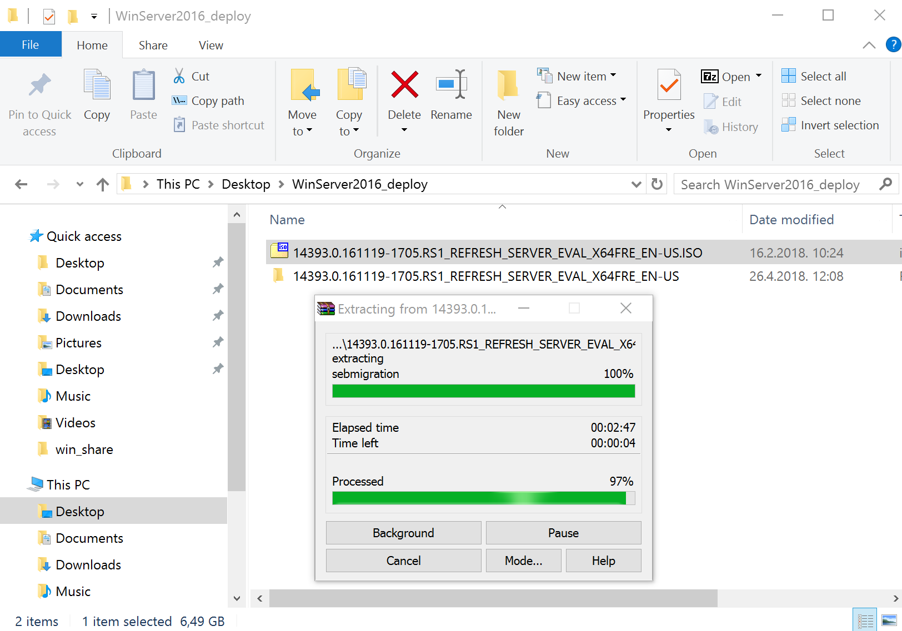

We will not use extracted files after answer file creation, just original .iso image.

After we have instalation files on our workstation, we will run Windows System Image Manager that we have installed in previous step.


In System Image Manager we have to import instalation image to create __answer file__.  


We are selecting __install.wim__ from the __/sources__ folder in extracted .iso image.
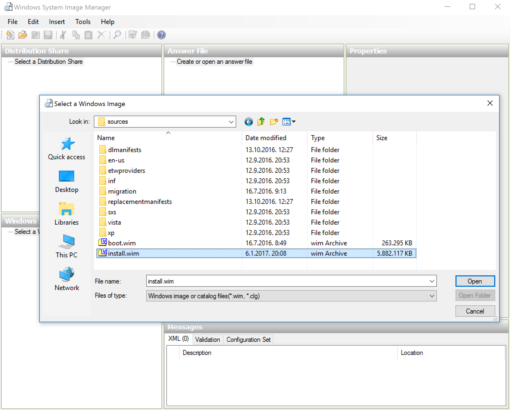

We have option to choose which version of operative system we want to prepare answer file for. We are selecting __Windows Server 2016 SERVERDATACENTER__.


We have to wait for few minutes while SIM is generating catalog file. After catalog file is created we will create new answer file (File > New Answer File). Now we can start adding components for our answer file.

First we are selecting __amd64_Microsoft-Windows-International-Core-WinPE\_neutral__ from lower left pane, and place it in answer file pane under __1. windowsPE__.

Then we have to specify language settings, you will enter values for your language preferences, we are entering __en-US__:

* __InputLocale:__ Keyboard layout (__en-US__)
* __SystemLocale:__ system locale language (__en-US__)
* __UILanguage:__ User Interface language (__en-US__)
* __UserLocale:__ per-user settings for currency, time, numbers... (__en-US__)


Click __+__ next to __amd64_Microsoft-Windows-International-Core-WinPE\_neutral__ in middle pane and navigate to __SetupUILanguage__ to specify the language used during Windows Setup.

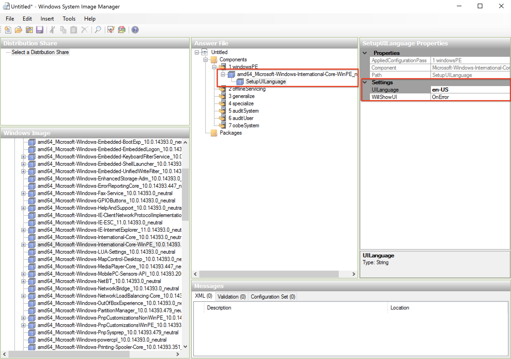


Next, we are selecting amd64_Microsoft-Windows-Setup, placing it in __1. WindowsPE__, navigating to __DiskConfiguration__ and right clicking on it to __Insert New Disk__.

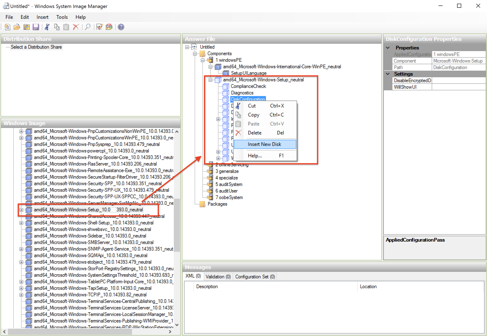


We have to create partitions on Hard Drive. We are using [this](https://docs.microsoft.com/en-us/previous-versions/windows/it-pro/windows-8.1-and-8/hh825701(v%3dwin.10)) Microsoft guide for configuring __BIOS/MBR-Based Hard Drive Partitions__:


Click __+__ next to __Disk__ in middle pane and right click on __CreatePartition__. Select __Insert New CreatePartition__. Populate settings based on above example. Repeate procedure for adding second partition.

Right click on __ModifyPartitions__. Select __Insert New ModifyPartition__. Again populate settings based on above example. Repeate procedure for modifying second partition.

Click __+__ next to __ImageInstall__, navigate to __InstallTo__ and populate it according to example.

After following this steps, your disk configuration should look like this:

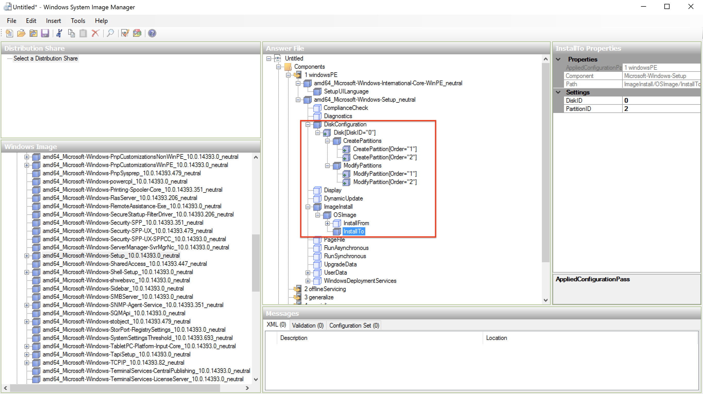

If you want to configure __UEFI/GPT-Based Hard Drive Partitions__, you can follow [this guide](https://docs.microsoft.com/en-us/previous-versions/windows/it-pro/windows-8.1-and-8/hh825702(v=win.10))

Now we are setting up __InstallFrom__ under __ImageInstall__. As there can be multiple Windows images inside __install.wim__, we have to look into it to select image we want to install.

To get a list of included OS instalations, we are going to run __dism__ tool (included in Windows OS) in command prompt and point to __install.wim__.

```
dism /Get-ImageInfo /ImageFile:<Path to file>\install.wim
```

We are getting following output from __dism__ tool:


In this example we want to install __Windows Server 2016 Datacenter Evaluation (Desktop Experience)__, which __index__ is __4__.


Right click on __InstallFrom__ and select __Insert New MetaData__, under settings enter key __/IMAGE/INDEX__ and value __4__

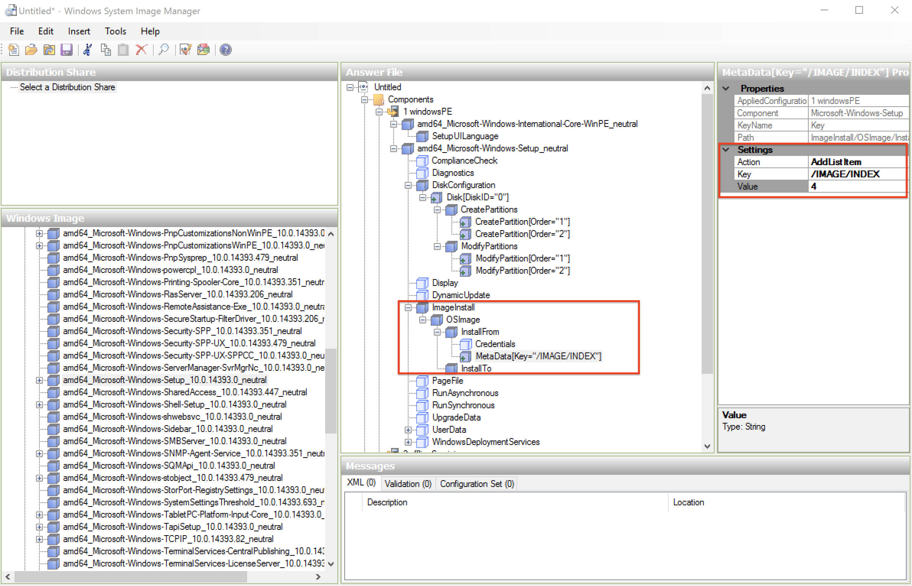

Next, we have to set up user data. Click on __UserData__ section and, set __AcceptEula__ to __true__ and fill in your settings.

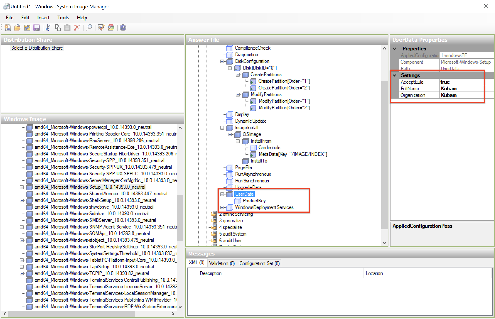

If you want to add __licence key__, you can add it in __ProductKey__ section. We are going to skip this part as we are working with evaluation image.

Next we are adding __amd64_Microsoft-Windows-Shell-Setup__ both to __4. specialize__ and __7. oobeSystem__ section. Under __4. specialize__ section fill in __ComputerName__ and __TimeZone__. For finding out right name your time zone you can use __tzutil /l__ comand in command prompt on your windows machine.

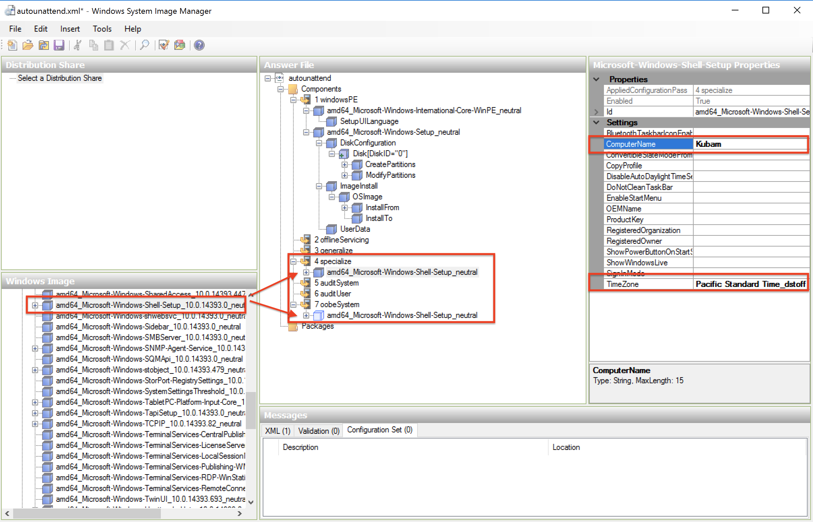

From oobeSystem section navigate to __UserAccounts__ > __AdministratorPassword__, and enter Administrator password (Example here is "Pa$$w0rd").

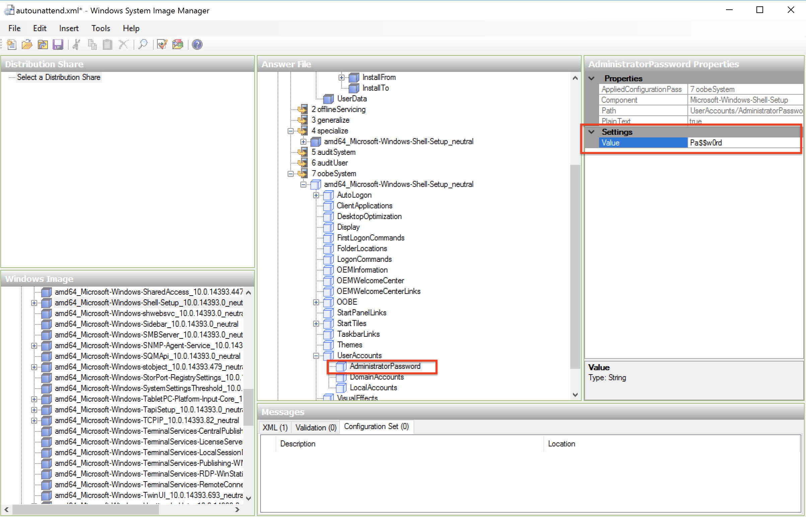

We will add __amd64_Microsoft-Windows-TerminalServices-LocalSessionManager__ to __4 specialize__ and set __fDenyTSConnections__ to false to enable the RDP connection.


Now we are going to configure folder where we will provide drivers for operative system during installation. From the left pane drag __amd64_Microsoft-Windows-PnpCustomizationsWinPE__ to __1 windowsPE__, right click on __DriverPaths__ and __Insert New PathAndCredentials__

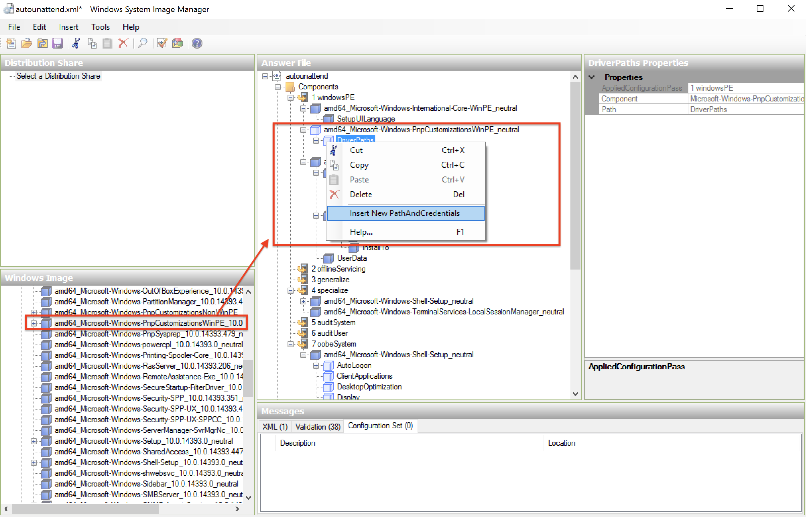

Next we are setting __PathAndCredentials__. __Key__ value __1__ and __Path: %configsetroot%\drivers__. With __%configsetroot%__ variable we are pointing to drive containing answer file.

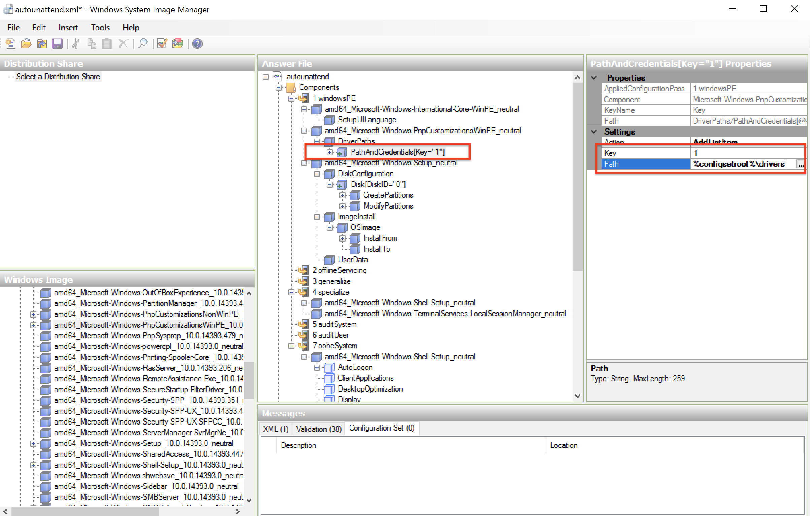

We need to set _UseConfigurationSet_ under __amd64_Microsoft-Windows-Setup__ to __true__ so setup is going to use Driver Paths folder that we have set up and copy it under __C:\Windows\ConfigSetRoot__ folder.

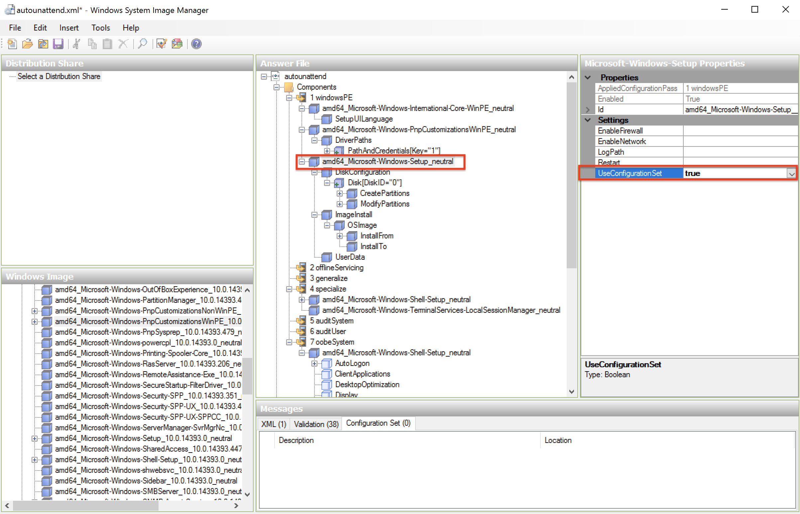

Under __7 oobeSystem__ inside __amd64_Microsoft-Windows-Shell-Setup__ right click to __FirstLogonCommands__ and __Insert New SychronousCommand__. Insert __C:\Windows\ConfigSetRoot\drivers\configure\configureos.cmd__ to __CommandLine__, add __Description__ and set __Order__ as __1__. 
File __configureos.cmd__ will contain instruction to run powershell script that we will do rest of the setup.


We are configuring __AutoLogon__ under same section that will run 3 times to run a PowerShell script with additional setup that will need reboots. We also need to provide password under __Password__ section (same that we have setup in earlier steps, in this example: Pa$$w0rd).

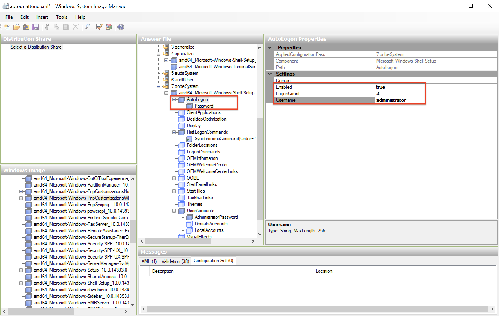


Now we have ready answer file, and we are going to save it as __autounattend.xml__ in our working folder (stage). 


Our answer file now looks like this:

```
<?xml version="1.0" encoding="utf-8"?>
<unattend xmlns="urn:schemas-microsoft-com:unattend">
    <settings pass="windowsPE">
        <component name="Microsoft-Windows-International-Core-WinPE" processorArchitecture="amd64" publicKeyToken="31bf3856ad364e35" language="neutral" versionScope="nonSxS" xmlns:wcm="http://schemas.microsoft.com/WMIConfig/2002/State" xmlns:xsi="http://www.w3.org/2001/XMLSchema-instance">
            <SetupUILanguage>
                <UILanguage>en-US</UILanguage>
            </SetupUILanguage>
            <InputLocale>en-US</InputLocale>
            <SystemLocale>en-US</SystemLocale>
            <UILanguage>en-US</UILanguage>
            <UserLocale>en-US</UserLocale>
        </component>
        <component name="Microsoft-Windows-Setup" processorArchitecture="amd64" publicKeyToken="31bf3856ad364e35" language="neutral" versionScope="nonSxS" xmlns:wcm="http://schemas.microsoft.com/WMIConfig/2002/State" xmlns:xsi="http://www.w3.org/2001/XMLSchema-instance">
            <DiskConfiguration>
                <Disk wcm:action="add">
                    <CreatePartitions>
                        <CreatePartition wcm:action="add">
                            <Order>1</Order>
                            <Size>350</Size>
                            <Type>Primary</Type>
                        </CreatePartition>
                        <CreatePartition wcm:action="add">
                            <Order>2</Order>
                            <Extend>true</Extend>
                            <Type>Primary</Type>
                        </CreatePartition>
                    </CreatePartitions>
                    <ModifyPartitions>
                        <ModifyPartition wcm:action="add">
                            <Active>true</Active>
                            <Format>NTFS</Format>
                            <Label>System</Label>
                            <Order>1</Order>
                            <PartitionID>1</PartitionID>
                        </ModifyPartition>
                        <ModifyPartition wcm:action="add">
                            <Format>NTFS</Format>
                            <Label>Windows</Label>
                            <Letter>C</Letter>
                            <Order>2</Order>
                            <PartitionID>2</PartitionID>
                        </ModifyPartition>
                    </ModifyPartitions>
                    <DiskID>0</DiskID>
                    <WillWipeDisk>true</WillWipeDisk>
                </Disk>
            </DiskConfiguration>
            <ImageInstall>
                <OSImage>
                    <InstallFrom>
                        <MetaData wcm:action="add">
                            <Key>/IMAGE/INDEX</Key>
                            <Value>4</Value>
                        </MetaData>
                    </InstallFrom>
                    <InstallTo>
                        <DiskID>0</DiskID>
                        <PartitionID>2</PartitionID>
                    </InstallTo>
                </OSImage>
            </ImageInstall>
            <UserData>
                <AcceptEula>true</AcceptEula>
                <FullName>Kubam</FullName>
                <Organization>Kubam</Organization>
            </UserData>
            <UseConfigurationSet>true</UseConfigurationSet>
        </component>
        <component name="Microsoft-Windows-PnpCustomizationsWinPE" processorArchitecture="amd64" publicKeyToken="31bf3856ad364e35" language="neutral" versionScope="nonSxS" xmlns:wcm="http://schemas.microsoft.com/WMIConfig/2002/State" xmlns:xsi="http://www.w3.org/2001/XMLSchema-instance">
            <DriverPaths>
                <PathAndCredentials wcm:action="add" wcm:keyValue="1">
                    <Path>%configsetroot%\drivers</Path>
                </PathAndCredentials>
            </DriverPaths>
        </component>
    </settings>
    <settings pass="specialize">
        <component name="Microsoft-Windows-Shell-Setup" processorArchitecture="amd64" publicKeyToken="31bf3856ad364e35" language="neutral" versionScope="nonSxS" xmlns:wcm="http://schemas.microsoft.com/WMIConfig/2002/State" xmlns:xsi="http://www.w3.org/2001/XMLSchema-instance">
            <ComputerName>Kubam</ComputerName>
            <TimeZone>Pacific Standard Time_dstoff</TimeZone>
        </component>
        <component name="Microsoft-Windows-TerminalServices-LocalSessionManager" processorArchitecture="amd64" publicKeyToken="31bf3856ad364e35" language="neutral" versionScope="nonSxS" xmlns:wcm="http://schemas.microsoft.com/WMIConfig/2002/State" xmlns:xsi="http://www.w3.org/2001/XMLSchema-instance">
            <fDenyTSConnections>false</fDenyTSConnections>
        </component>
    </settings>
    <settings pass="oobeSystem">
        <component name="Microsoft-Windows-Shell-Setup" processorArchitecture="amd64" publicKeyToken="31bf3856ad364e35" language="neutral" versionScope="nonSxS" xmlns:wcm="http://schemas.microsoft.com/WMIConfig/2002/State" xmlns:xsi="http://www.w3.org/2001/XMLSchema-instance">
            <AutoLogon>
                <Password>
                    <Value>UABhACQAJAB3ADAAcgBkAFAAYQBzAHMAdwBvAHIAZAA=</Value>
                    <PlainText>false</PlainText>
                </Password>
                <Enabled>true</Enabled>
                <LogonCount>3</LogonCount>
                <Username>administrator</Username>
            </AutoLogon>
            <FirstLogonCommands>
                <SynchronousCommand wcm:action="add">
                    <CommandLine>c:\Windows\ConfigSetRoot\drivers\configure\configureos.cmd</CommandLine>
                    <Description>Configure OS</Description>
                    <Order>1</Order>
                </SynchronousCommand>
            </FirstLogonCommands>
            <UserAccounts>
                <AdministratorPassword>
                    <Value>UABhACQAJAB3ADAAcgBkAEEAZABtAGkAbgBpAHMAdAByAGEAdABvAHIAUABhAHMAcwB3AG8AcgBkAA==</Value>
                    <PlainText>false</PlainText>
                </AdministratorPassword>
            </UserAccounts>
        </component>
    </settings>
    <cpi:offlineImage cpi:source="wim://vmware-host/shared%20folders/desktop/winserver2016_deploy/14393.0.161119-1705.rs1_refresh_server_eval_x64fre_en-us/sources/install.wim#Windows Server 2016 SERVERDATACENTER" xmlns:cpi="urn:schemas-microsoft-com:cpi" />
</unattend>
```

You can use this file as a template, without need to do compleate procedure, just change values according to your preferred settings.

## Downloading drivers

Next step is to [download UCS drivers for Windows](https://software.cisco.com/download/home/283853163/type/283853158/release/3.2%25283a%2529) from Cisco, in this example we are installing UCS B-series servers, so we are downloading drivers for UCS B.

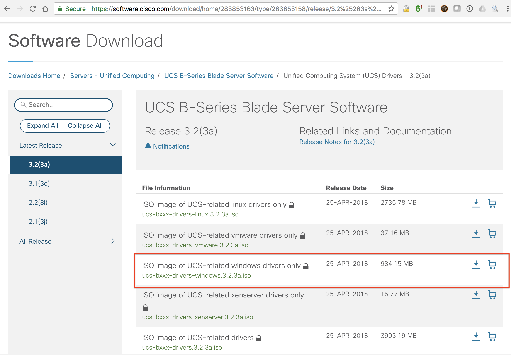

## Packing answer file and drivers

Create new folder named __drivers__ in working folder. Copy and extract downloaded .iso file (we were using 7-zip here) into working folder.

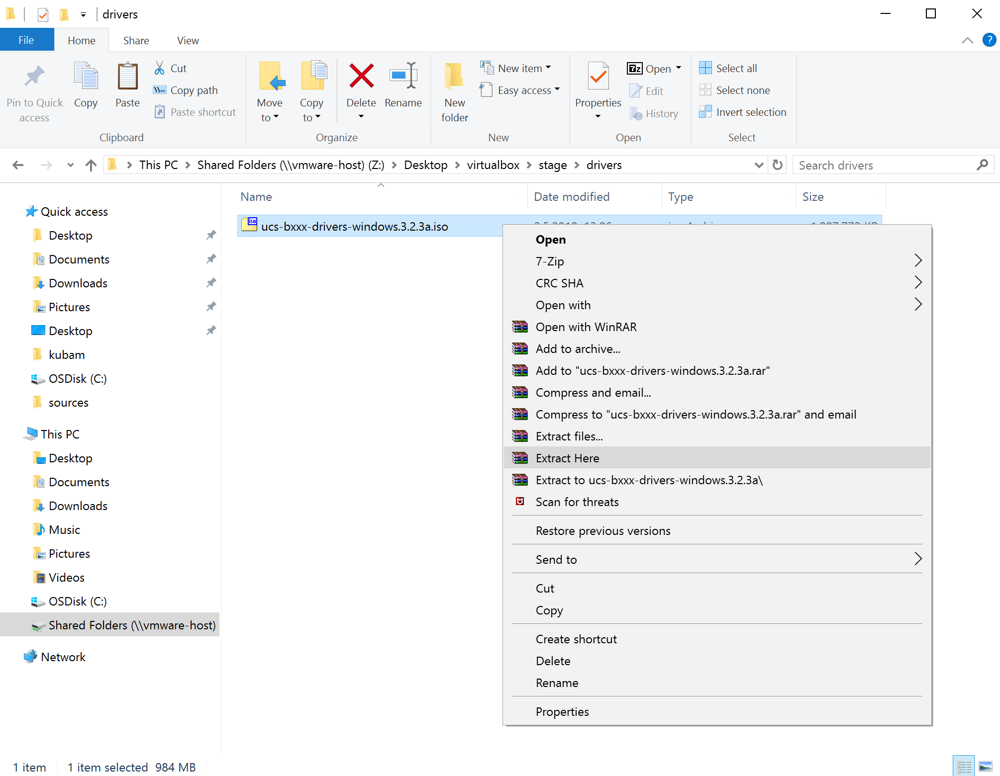

Delete __Video, release.txt, tag.txt and driver .iso__ file from __drivers__ folder.

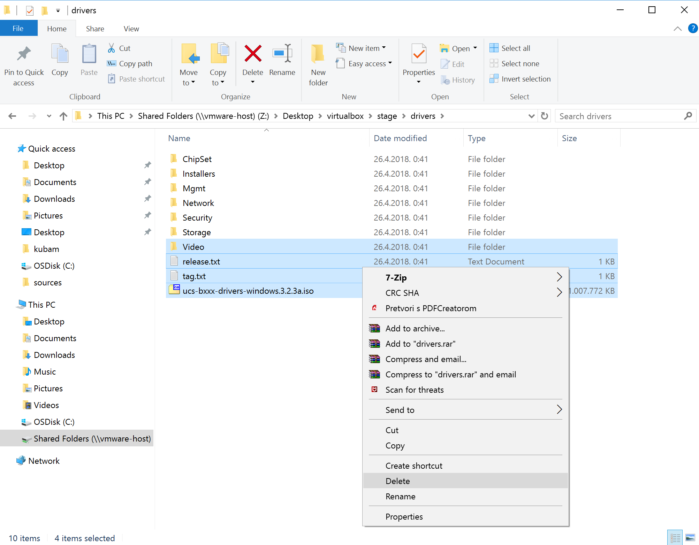

Go back to working folder, select __drivers__ filder and __autoattend.xml__ file and pack them to __stage.zip__

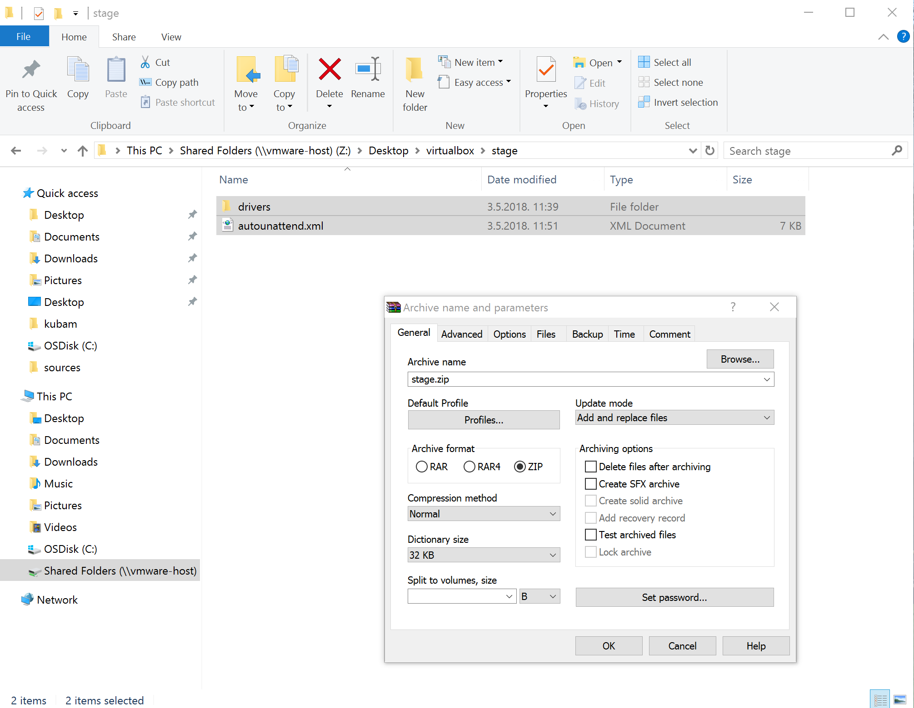 

[Download](https://winscp.net/eng/download.php) and install WinScp, and create new session to connect to Kubam server using SCP protocol. Open __/root/kubam__ folder in right pane and our working folder (stage) in left pane.

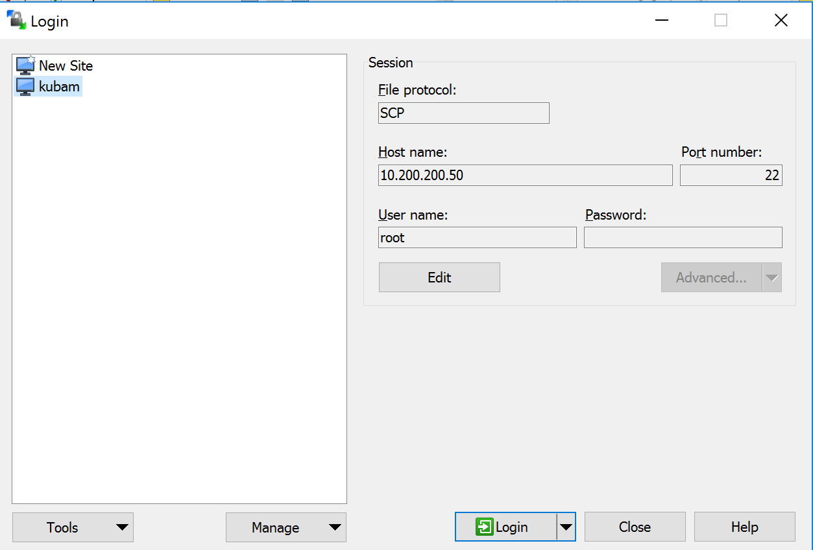

Upload __stage.zip__ to kubam server into __/root/kubam__ folder (drag and drop).

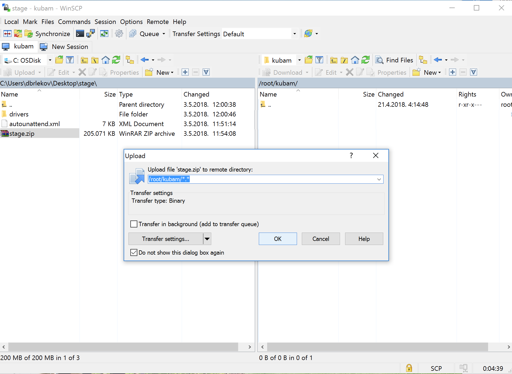

Log into kubam server and navigate to /root/kubam folder. There should be __stage.zip__ file. Using bellow commands we will create __win2016.img__ file containing drivers and answer file. 

```
unzip -qq stage.zip
rm -f stage.zip
dd if=/dev/zero ibs=1024 count=300000 of=win2016.img
mkfs -t fat win2016.img  
mkdir mnt
mount -o loop win2016.img mnt
mv -t mnt autounattend.xml drivers
umount mnt
rm -Rf mnt
```
After running commands, you should have similar output on kubam server.

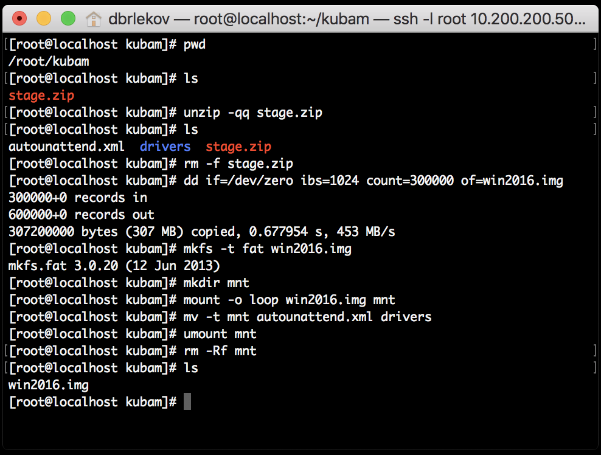

We will copy __win2016.img__ back to our workstation.

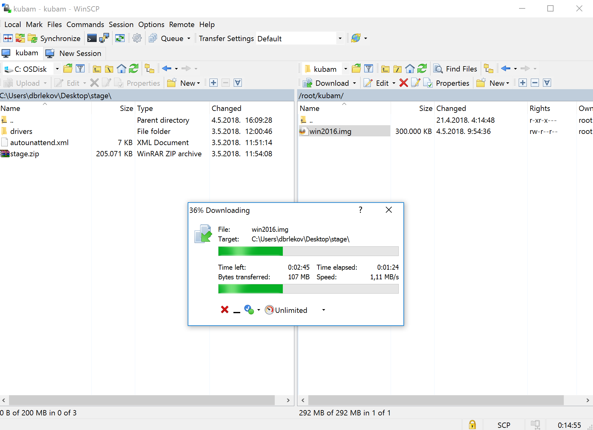

Next step is to copy created __win2016.img__ and windows 2016 installation image (14393.0.161119-1705.RS1\_REFRESH\_SERVER\_EVAL\_X64FRE\_EN-US.ISO) to network share wich will be available for UCS Manager. First we will rename .iso image to __win_server_2016.iso__ for convenience. 

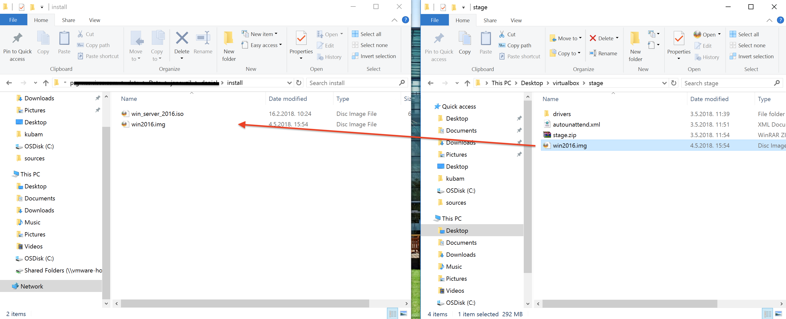

## Add installation files to vMedia Policy

In UCS manager create Vmedia Policy and set it according to pictures bellow, pointing __win_server_2016.iso__ and __win2016.img__ to shared location.

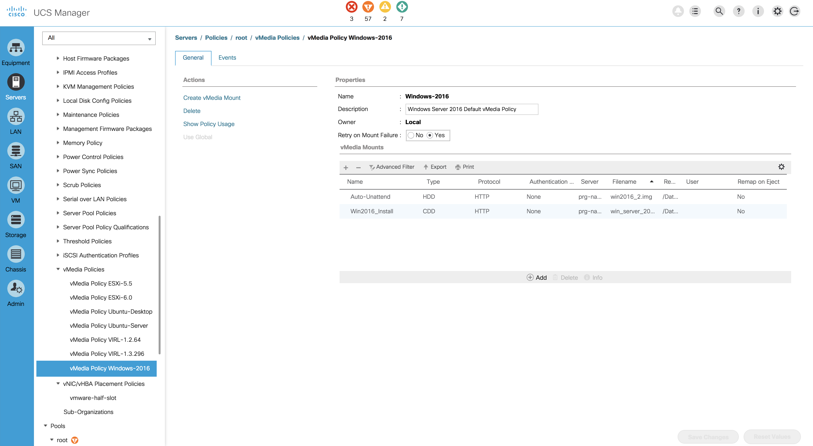

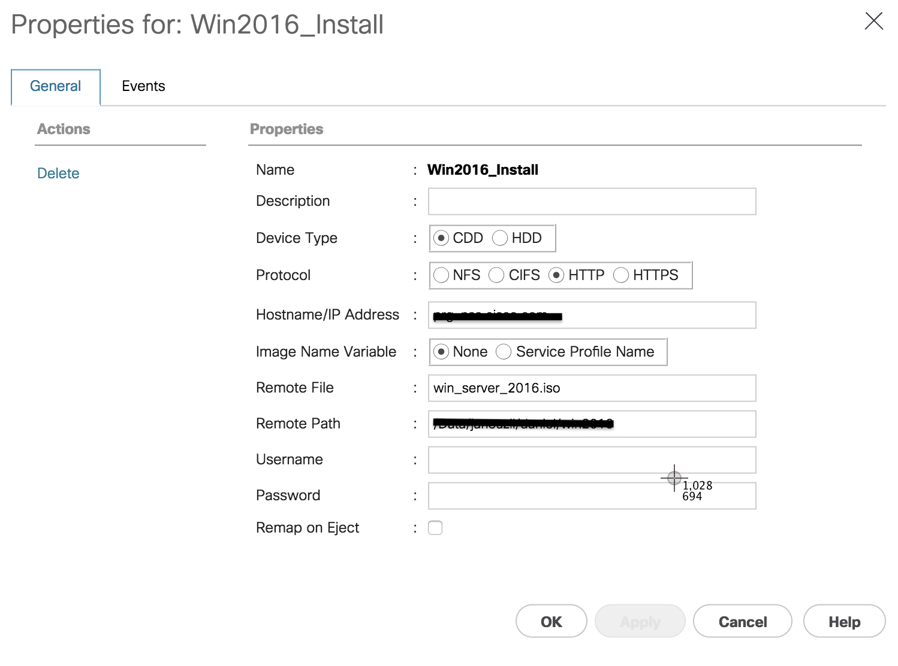

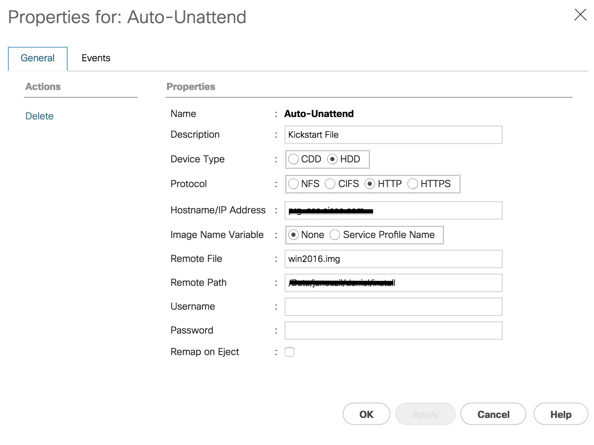

Start server, open KVM, take popcorns and enjoj:). 
Now you have Zero-Touch Windows 2016 installation for your servers!


And after few minutes you can log on with username (administrator) and password (Pa$$w0rd) set in __autounattend.xml__ file. 
