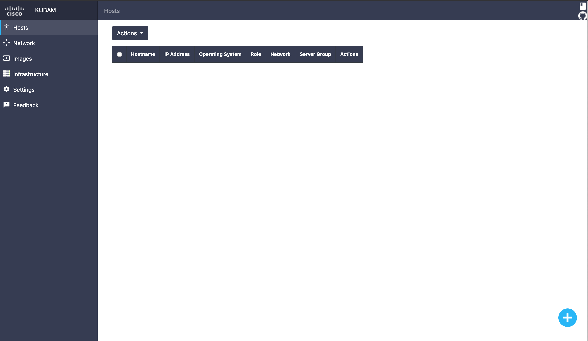
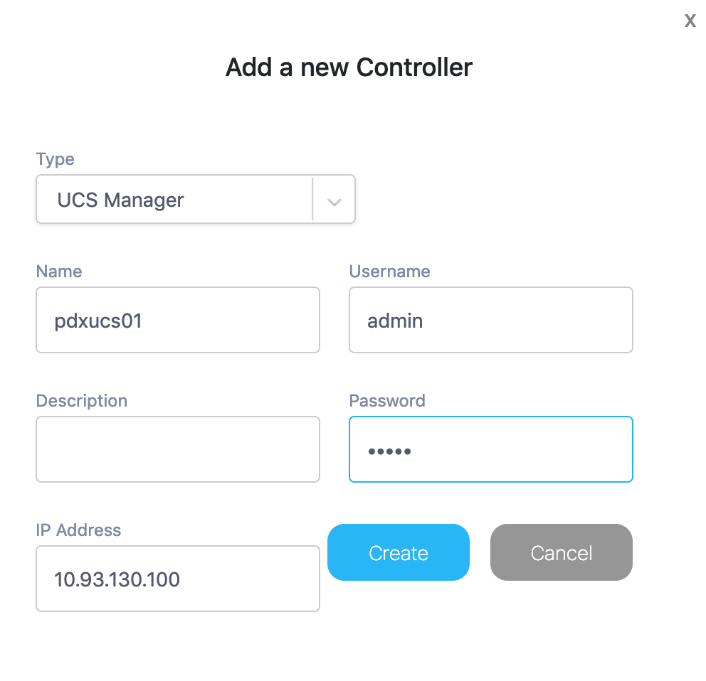
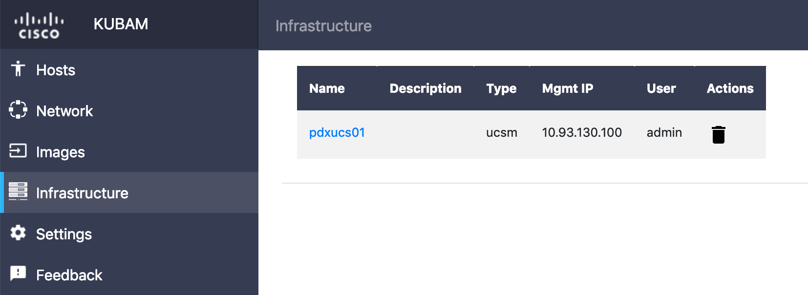

# KUBAM Credentials

KUBAM stores its data in the `~/kubam/kubam.yaml` file.  So you could have a complete file that has all the information instead of using APIs or the GUI to fill it all out.  The one place you can't do this easily is with the Credentials for UCS, IMC, or UCS Central. 

Here it is easiest to use the GUI.  Open the web browser to `http://$KUBAM_API:5000/`.  



To add devices to KUBAM we go to the `Infrastructure` tag and add the server components. 



This is just the UCS password.  KUBAM encrypts the password in the `~/.kubam.yaml` file.  You can look at this file and it looks something like: 

```
server_groups:
- credentials:
    ip: 10.93.130.100
    password: gAAAAABcZ1hBl0t81VXEzf7IeWgHDIU6TISEele_4niASZRWcq98D1IUz7ekb0AVnO-PdeqSCxK2u3H3xLOda979JpaLcmE3XQ==
    user: admin
  description: ''
  id: a296e465-c221-4e4f-9159-c4bb23485179
  name: pdxucs01
  type: ucsm
```

KUBAM makes sure that this UCS system can be reached.  If it can you will see an entry in the dashboard:




You could also use the API to do this action.  See the [API Walkthrough](https://ciscoucs.github.io/site/kubam/developer/APIGUIDE.html).  

Next up, its time to talk about everybody at Cisco's favorite topic:  [Networking](https://ciscoucs.github.io/site/kubam/configure/network.md)


