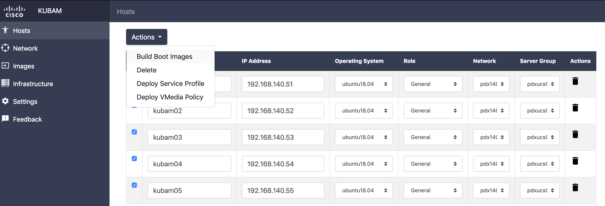

# Deploy install Images

At this point all values should be filled out and servers may be customized with auto install template files.  Our next step is to make the deployment images with these yet to be installed systems. 

This is done by returning to the `Hosts` tab and checking the servers.  Then by clicking `Build Boot Images`.

This will then build the files in the `~/kubam` directory required for the service profile templates. 

Currently the GUI does not implement the other features such as `Deploy VMedia Policy`, or other items in the menu.  Sorry about that.  Next all you need to do is build your service profiles from templates that have VMedia profiles correctly and the machine will boot up into the OS.  Beautiful!