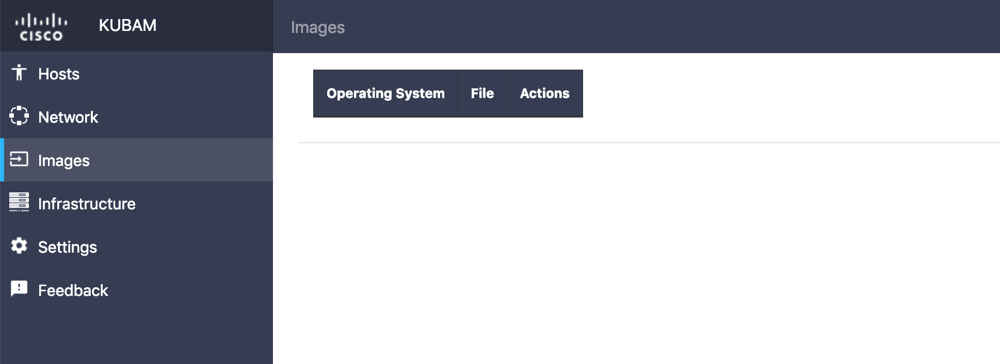
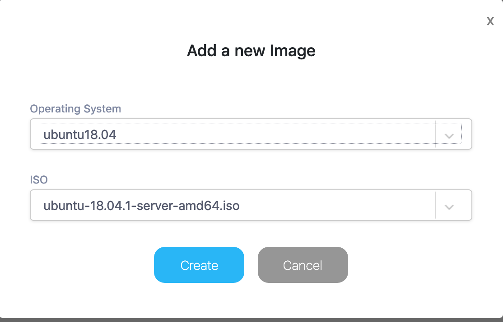
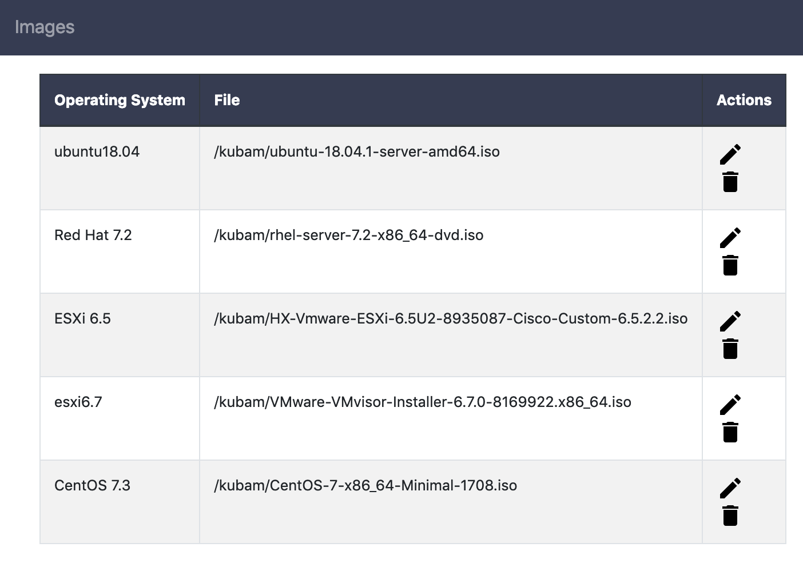

# Configuring Boot Images

For installing systems we need to create the install media.  It is different for each server but the method to get the media into an installable form is what KUBAM does best!

## 1. Copy ISO images

For a machine to boot up you will need to download the ISO image and place it on the KUBAM server in the `~/kubam` directory.  

This is simply done by using SSH, or whatever other copy command you have.  Once the ISO image is in the `~/kubam` directory you can see what images are available with: 


```
curl $KUBAM_API/api/v1/isos
```
This will return any number of items if there are `iso` files in the directory.  For example: 

```
{
  "isos": [
    "ubuntu-18.04.1-server-amd64.iso"
  ]
}
```

Using the GUI we will first see an empty list

  

## 2. Put ISOS in KUBAM config

Let's configure the KUBAM system to have ISO information.  

### 2.1 GUI

We can add an ISO image by clicking the plus in the bottom right side. 



We can use the dropdown to create a mapping with all the different ISOs that we have. 



### 2.2 CLI/API
The next command you will want to do is map the ISO files. To see what is already mapped we can run: 

```
curl $KUBAM_API/api/v1/isos/map
```

This may show something like: 

```
{
  "iso_map": [
    {
      "file": "/kubam/CentOS-7-x86_64-Minimal-1708.iso",
      "os": "centos7.4"
    },
    {
      "file": "/kubam/VMware-VMvisor-Installer-6.7.0-8169922.x86_64.iso",
      "os": "esxi6.7"
    }
  ]
}
```
Or if you are just getting started, nothing at all!  Supposing we had nothing we can do this with another curl call: 

```
curl -X POST $KUBAM_API/api/v1/isos/map \
	-d '{"iso_map" : [{"os" : "ubuntu18.04", "file" : "/kubam/ubuntu-18.04.1-server-amd64.iso"}]}' \
	-H "Content-Type: application/json"
```

(notice the `/kubam` directory that is because the container mounts the `~/kubam` directory to be the `/kubam` directory)

This will give us the output to show it is mapped: 

```
{
  "iso_map": [
    {
      "file": "/kubam/ubuntu-18.04.1-server-amd64.iso",
      "os": "ubuntu18.04"
    }
  ]
}
```

Next it's time to [Add more settings](https://ciscoucs.github.io/site/kubam/configure/settings.html)


