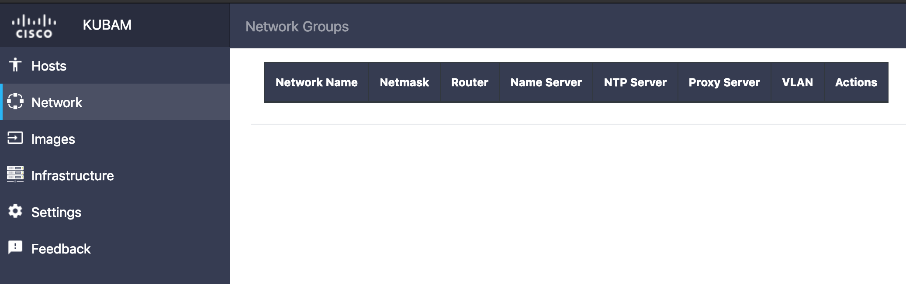
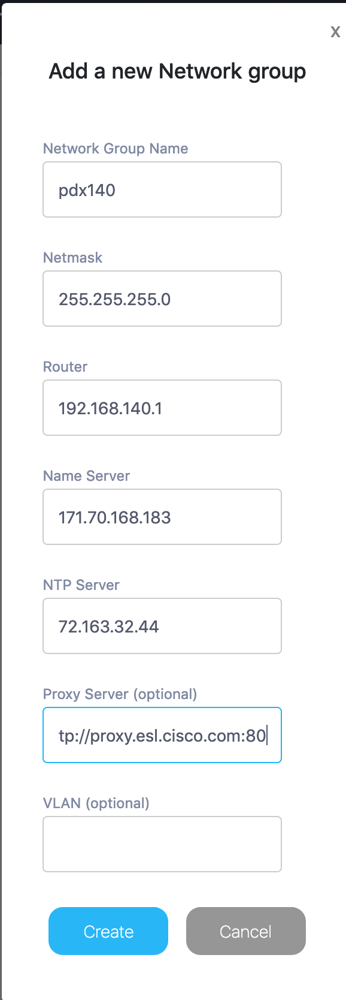
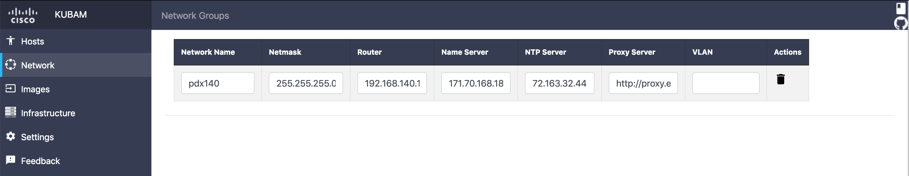

# KUBAM Networking

We need to tell KUBAM how to setup the networking for the operating systems we will be installing.  On the GUI this is simple.

First we go to the Network page

At the bottom right we add a new network.  The information you put in this field is the information you would like to apply to the operating system of a subset of nodes.  For example, you may name this pdx140, meaning all nodes that are in the 140 VLAN in my PDX group will get the same nameserver, subnet, netmask, ntp, etc. 

One of the fields in there `proxy` is to deal with machines that may require a proxy server to escape the local network.  This usually happens behind corporate firewalls like the one in which Kubam was developed in. 

The othe field VLAN is for times when the network ports the servers are connected to do not have native VLANs and need to specify it in the port.  Usually we see this in ESXi installations.  

KUBAM tries to make it easy for you to edit and update these values.  Keep in mind that if you do update, new boot images would need to be created. 

Next up, you need to select the [servers](https://ciscoucs.github.io/site/kubam/configure/servers.html).

