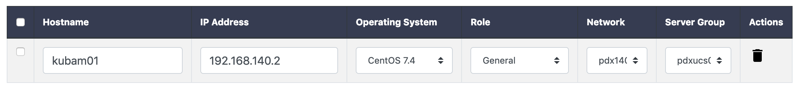

# Server Configuration

In this step we select the servers we would like to install. This is in the hosts pane and the two words are used interchangeably.  


We add a new host by clicking the blue button below


In this step, KUBAM tries to be smart and creates the first available IP address on the first network using the first Network that was defined as well as the first server group.  Isn't that nice? 

You can change or edit the fields and then create a whole bunch of other hosts.  The KUBAM GUI autocompletes so it should be fairly easy to change the first one, then all nodes beneath. 

You have two other options for adding servers.  The first is to do it via the API as documented in [Step 5 in the API walkthrough](https://ciscoucs.github.io/site/kubam/developer/APIGUIDE.html).

The second is to simply open the `~/kubam/kubam.yaml` file and add these manually. (I've written scripts to populate this as well when we've gotten into the 100s of nodes). 

As an example, here are two host entries: 

```
hosts:
- ip: 10.93.140.91
  name: node01
  network_group: pdx140
  os: ubuntu18.04
  role: generic
  server_group: lucky
- ip: 10.93.140.92
  name: node02
  network_group: pdx140
  os: ubuntu18.04
  role: generic
  server_group: lucky
```

(The `server_group` applies to the infrastructure of UCS and isn't really needed today)

When completed you should be able to see all the hosts we need!


Next up, we need to copy the [ISO images](https://ciscoucs.github.io/site/kubam/configure/iso.html). 

