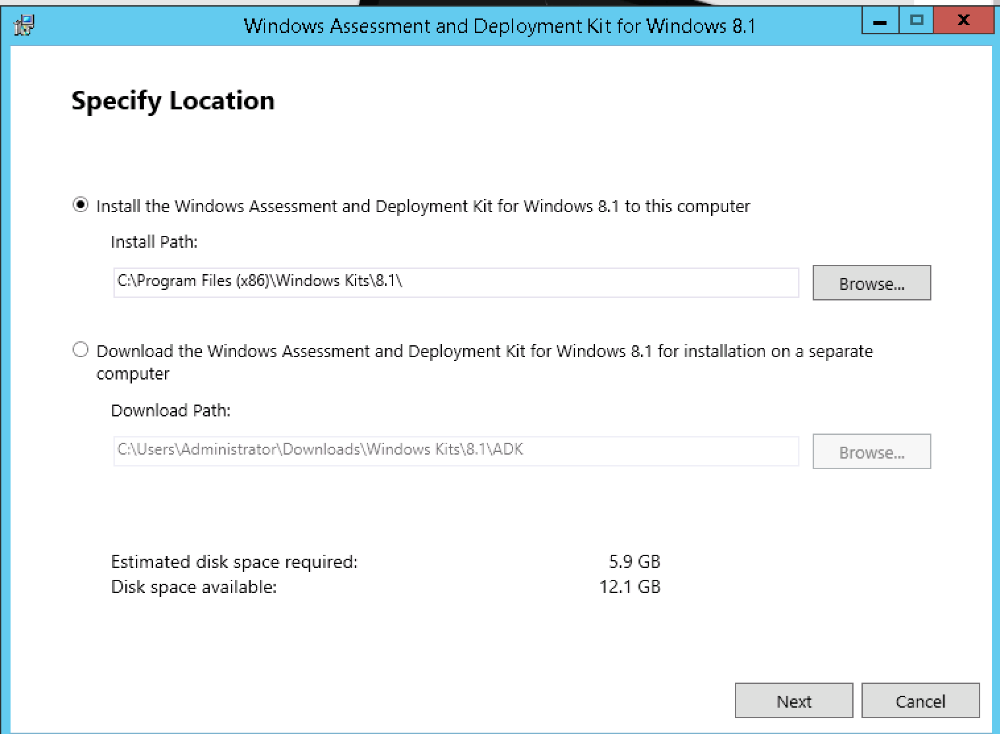
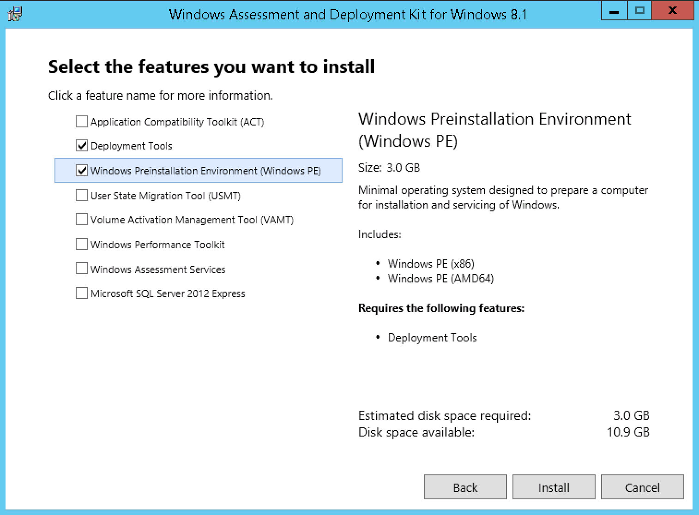

# Windows Installation

KUBAM can be used to deploy Windows. We support

* Windows 2012 R2
* Windows 2016

At this time KUBAM requires a decent amount of manual steps to install Windows.  We are working to make this easier but we still hope this method sucks less than other installers that you are using.  


## Windows Server 2012 R2 (WIP)

KUBAM requires that you stage an install image on an existing 'Stage' Server.  The Stage server should be running the same version of Windows that you would like to install.  These instructions are for Windows Server 2012 R2 Datacenter.

The stage server can be a virtual machine or physical machine.  If it is a physical machine it does not need to be running on Cisco hardware. 

The following should be performed on the Stage Server:

### Download Windows ADK

The Windows Assessment and Deployment Kit (ADK) is required to build WinPE images that KUBAM can use.  [Download this from Microsoft]().

Install using the default directory.



We only require the two services to be installed:

* Deployment Tools
* Windows PE




While this installs about 3 GB, have a look at one of our [developers bee keeping websites](http://www.opg-brlekovic.hr/).  If you happen to be in Croatia you can order some honey.

### Download Cisco Drivers

The latest Cisco device drivers can be downloaded from Cisco's Support site. URLs seem to change from time to time, but was last available [here](https://software.cisco.com/download/home/283853163/type). If that link is dead, go to [https://cisco.com/support](https://cisco.com/support) and in the Downloads menu type __UCS B-Series Blade Server Software__ the main Cisco Site, then download the drivers.  It seems to be a 1GB file.  

Copy the Windows VNIC drivers to the Windows server.  Put it in the ```C:\Drivers``` directory:

```
mkdir c:\drivers
```

You should then have the VNIC drivers in this directory

```
enic6x64.cat
enic6x64.inf
enic6x64.sys
```

### Run ```winkubam.cmd``` 

With the two prereqs in place you are ready to generate the WinPE image that will be used for the boot process. 


### Manually Creating Autoinstallation Files

UCS needs a hard drive image that includes the ```autounattend.xml``` file.  This image can be created using: 

```
dd if=/dev/zero of=kube0${i}.img bs=1M count=1
mkfs -t fat win.img
mkdir tmpmnt
mount -o loop win.img tmpmnt
## copy files in
umount tmpmnt
rmdir tmpmnt
```