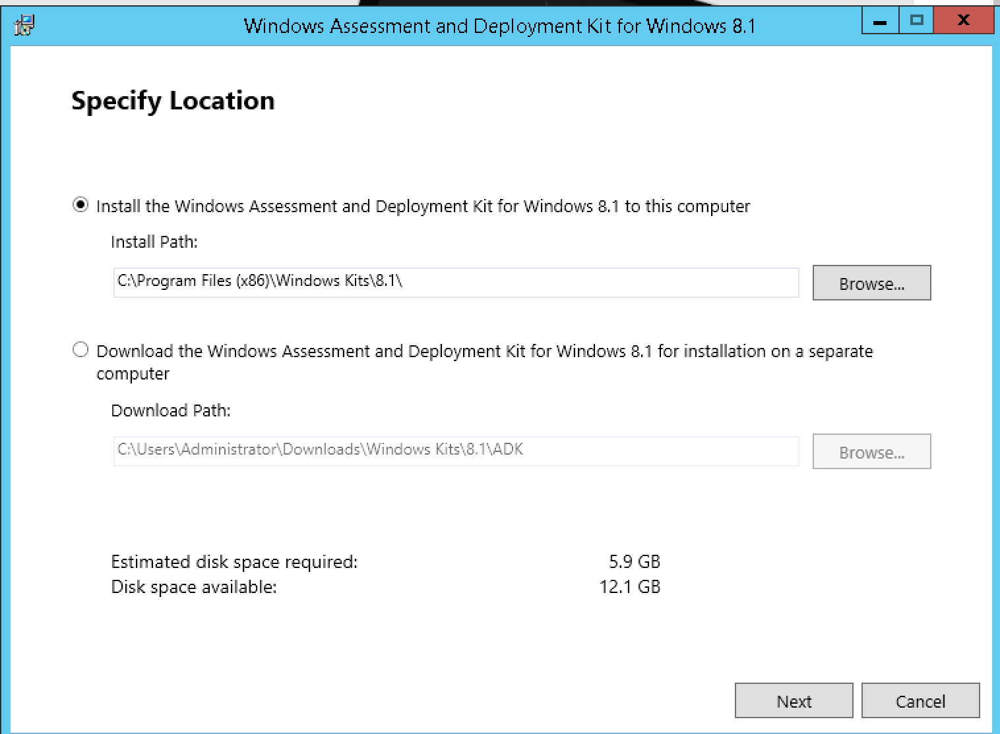

# Windows Server Installation

Installing Windows with KUBAM isn't as easy as we'd like it to be. Still, its better than many of the other sucky methods you'll run into out there in the wild. KUBAM makes doing it on UCS easy as possible!

We support: 

* Windows Server 2012 R2
* Windows Server 2016 

Need support for a different version? [Let us know](https://github.com/CiscoUcs/KUBaM/issues)

Here is the high level list of tasks that you have to do:  

* Create a WinPE image on existing Windows Server with UCS drivers using the KUBAM ```winkubam.bat``` script. 
* Copy WinPE ISO image and drivers to KUBAM server
* Copy Windows Server ISO image to the KUBAM server
* Customize the Windows Answer File
* In the KUBAM GUI: Extract the ISO and copy template.
* Setup SAMBA on the KUBAM server (1 command)
* Deploy Servers

We'll go through each of these steps in detail.  

## Windows Technician Computer Setup

Windows installs require that you create an install image on an already installed [Windows Technician Computer](https://docs.microsoft.com/en-us/windows-server-essentials/install/prepare-the-technician-computer).  The Technician computer should be running the same version of Windows that you would like to install.  These instructions are for Windows Server 2012 R2 Datacenter.  This WinPE image can be used to install Server 2016 and Server 2012 R2

The technician computer can be a virtual machine or physical machine.  If it is a physical machine it does not need to be running on Cisco hardware to create this image.

### Download Windows ADK 8.1

The Windows Assessment and Deployment Kit (ADK) is required to build WinPE images that KUBAM can use. Yes, we know this version is old, but it works so we use it.  We'll update it when the need arises.

[Download this from Microsoft](https://www.microsoft.com/en-us/download/details.aspx?id=39982).

Install using the default directory.



We only require the two services to be installed:

* Deployment Tools
* Windows PE

(We actually probably only need Windows PE, but the other one is there for good measure)


While this installs about 3 GB, have a look at this [bee keeping website](http://www.opg-brlekovic.hr/), run by Daniel one of our developers.  If you happen to be in Croatia you can order some honey.

### Download Cisco Drivers

The latest Cisco device drivers can be downloaded from Cisco's Support site. URLs seem to change from time to time, but was last available [here](https://software.cisco.com/download/home/283853163/type). If that link is dead, go to [https://cisco.com/support](https://cisco.com/support) and in the Downloads menu type __UCS B-Series Blade Server Software__ the main Cisco Site, then download the drivers.  It seems to be a 1GB file.  

Copy the __Windows 2018 R2__ VNIC drivers to the Windows server.  Put it in the ```C:\Drivers``` directory:

```
md c:\drivers
```

You should then have the VNIC drivers in this directory

```
enic6x64.cat
enic6x64.inf
enic6x64.sys
```

_NOTE: Even if you are planning on deploying Server 2016 you should use the Server 2012 R2 drivers for the WinPE image.  You'll need the other drivers for 2016 for the second part of the installation so just hold on to those!_

### Download KUBAM Windows Scripts on Technician Node

We will be creating a WinPE image that uses KUBAM and an autoattend file. To make this work we need to use the following files:

* ```winkubam.bat``` - This is the script that will create the WinPE image adding the drivers and the new ```startnet.cmd``` file. 
* ```startnet.cmd``` - This file is placed in the WinPE file and is the customized startup file we use for installing using the vMedia + the KUBAM CIFS servers. 

#### Explanation of ```startnet.cmd```

```startnet.cmd``` is the command that starts up the windows installation process in the WinPE image.  We customize it to do the following:

* Looks in the c:\ drive to get the IP address of the machine in the file ```network.txt``` (KUBAM creates this for you)
* Mounts the KUBAM CIFS Share that has the installation media.
* Runs ```setup.exe``` with the autoattend.xml file found in the c:\ drive placed there by KUBAM.   

### Run ```winkubam.bat``` 

With the prereqs in place (WinPE and drivers) you are ready to generate the WinPE image that will be used for the boot process. Open the shell and run: 

```
winkubam.bat
``` 

At the end of this process you'll have a ```c:\WinPE_KUBAM.iso``` file which is the WinPE.

### Copy Files to KUBAM Server

#### WinPE image to KUBAM server

```scp``` or use some other radical means of getting the ```c:\WinPE_KUBAM.iso``` file to the KUBAM server.  Please keep the name of this file the same as KUBAM looks for its presence. 

#### Drivers to KUBAM server

KUBAM will also need the drivers to put into the image that gets installed.  To do this, log into the kubam server and run: 

```
ssh <kubam-server>
cd ~/kubam
mkdir -p windows/drivers/win2012r2
mkdir -p windows/drivers/win2016
```
Now copy the drivers to the appropriate ```~/kubam/windows/drivers``` directory. 

This is a pain, but notice there are two images that get the UCS drivers:  The WinPE image for booting and then the actual image it installs.  Copying the drivers to the KUBAM server is for the installed image to have them.  

## Extract Windows ISO image 

On the KUBAM server, use the API or GUI to extract the Windows ISO image to the KUBAM server.  It will place it in either the ```win2012r2``` directory or ```win2016``` directory. 

## Add Custom Template

If you have (recommended) your own autoinstall.xml file put it in the ```~/kubam/``` directory and name it either ```win2016.tmpl``` or ```win2012r2.tmpl``` depending on which Operating System you are using. We recommend you base it off our [sample templates](https://github.com/CiscoUcs/KUBaM/tree/v2.0/kubam/templates) so you get the driver installation and RDP. 


## Start KUBAM SAMBA server

The windows installation media is pretty big (4.3GB for Server 2012 R2).  As such, using the 1Gb CIMC link is pretty slow.  Instead we'd like to use the 40Gb links on the server.  For that to install we use the vNICs on the UCS server to connect to the KUBAM server.  But we will need to use CIFS to do this.  This is done by running the following command on the KUBAM server: 

```
docker run -d -v ~/kubam:/kubam \
           -p 139:139 -p 445:445 \
           dperson/samba \
           -s "kubam;/kubam"
```
More information on this container is available [here](https://github.com/dperson/samba)

## Build Images

With all the files in place the automated deployment is ready to go.  You can now create the individual image files using the KUBAM GUI or API.  The names of these image files will be the name of the UCS Service Profile.

## Deploy Servers

Now deploying the servers either through the API or the GUI will create Service Profiles, templates and a vMedia policy that will map to the appropriate OS files.  The Server should now install. 

# Appendix

## Manually Building Service Profile Images used for Autoinstallation Files

__This is done by KUBAM automatically but we spell out here what the process actually does__

KUBAM works by having the WinPE image grab several files from the UCS hard drive image. This includes: 

* ```autounattend.xml``` file.  This is the template for this image to install. 
* ```network.txt``` file.  This file contains the network settings of our node and is used for starting up the server and mounting the CIFS share.  

Why do we do this?  Well, we want each node to be unique.  We could cram all this into the WinPE image but then we'd have a different WinPE image for every node, which means a lot of storage.  By breaking it out, we use the least amount of storage as possible with the most flexibility. 

Let's create the image by hand on a Linux server:   

### The ```network.txt``` file.  

This is a simple file with three lines that looks like:

```
<ip>
<netmask>
<gateway>
<KUBAM IP>
<os>
```
__Example:__

```
172.28.225.134
255.255.254.0
172.28.224.1
172.28.225.135
win2016
```

### The ```autoinstall.xml``` file

Check out our [samples](https://github.com/CiscoUcs/KUBaM/tree/v2.0/kubam/templates) for what this could look like.  Note that these are templates and appropriate values should be stored in there.  The file should be called ```autoinstall.xml``` when installed. 

You should create your own to match the stuff you need.


### Baking the Image

Now you can run the following: 

```
dd if=/dev/zero of=kubam01.img bs=1M count=1
mkfs -t fat kubam01.img
mkdir tmpmnt
mount -o loop kubam01.img tmpmnt
cp autoinstall.xml tmpmnt/
cp network.txt tmpmnt/
umount tmpmnt
rmdir tmpmnt
```

This can get tedious for a bunch of nodes.  This is why we use KUBAM to automate this part!

