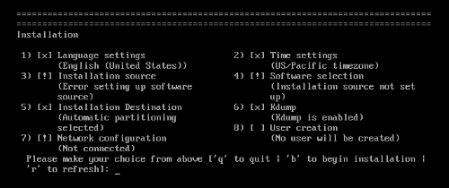
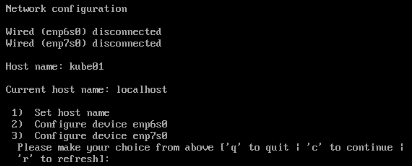

# KUBAM Troubleshooting

KUBAM works so great except when it doesn't.  Let's go over some issues we've seen crop up. 


## No Network during installation

Suppose you get a picture like this one below:



Here it says the network configuration is incorrect or not connected.  This usually means there is a mismatch between the automated kickstart image and what the node is seeing.  Let's see what the node thinks it's nics are:

Pressing __7__ and enter at the prompt gives us the below: 



Interesting!  The blade thinks it has ```enp6s0``` and ```enp7s0``` for nics.  

Now let's go look at the kickstart file.  

In the ```~/kubam/``` directory we can see this node's image file that it gets when it boots.  

```
cd ~/kubam
mkdir foo
mount -o kube01.img
mount -o loop kube01.img foo
cd foo
vi ks.cfg
```
Examining this file we see that the networking stanza looks like the below: 

```
network --activate --bootproto=static --ip=10.52.248.213 --netmask=255.255.255.224 --gateway=10.52.248.193 --nameserver=10.52.248.72 --device=eno1
network  --hostname=kube01
```
KUBAM expects there is a nic named ```eno1``` but our node shows ```enp6s0``` and ```enp7s0```.  We could change the ```ks.cfg``` file right now, reboot and if the new ```*.img``` file takes affect the kickstart file will go through just fine.  

But why does KUBAM expect it to be ```eno1```?  Well this is because KUBAM expects [Consistent Device Naming]() to work.  As part of setup, KUBAM creates a BIOS policy that tells the device it should conform to consistent names.  None of this 6 or 7 in the nic names. Start from 0 and go.  

Great, so why isn't consistent device naming working?  In our case, one node worked fine but the other didn't.  This suggests something different about the node.  But we show the nodes are identical!  That tells us to look at the BIOS. 

Sure enough we see below: 


The VIC 1240 is booting off of 2.2(2c) instead of the 4.1(2d) that the other servers are.  Let's update this dude!


The firmware should be activated next boot.  We reboot the blade by exiting out of the installation menu. Soon enough, boom!  Our blade comes up on next boot with the right version. 

