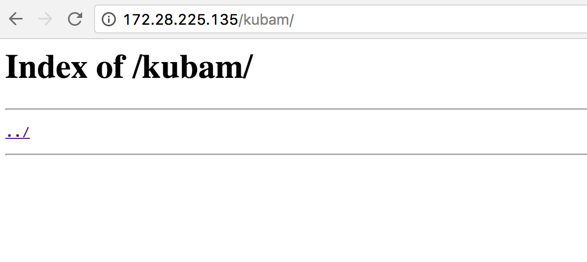

For the UCS Bare Metal setup KUBaM uses vMedia Policies to do the automated installation.  This requires the following prereqs: 

* UCS Manager 2.2(2c) or higher.  (Preferably higher... come on!  Update your UCS!)
* B200 M3 or C2XX M3 servers or higher.  Servers below these models don't allow vMedia policies. 
* One Master Server that has access to UCSM and the Kubernetes Network.  It works easiest if the Master Server is on the same subnet of the kubernetes nodes, but this is not a requirement as long as 

# 0. Make sure package management tool is working

## RedHat/CentOS

Make sure you have ```yum``` set up to get packages. 

### Red Hat

Example:  If you are behind a firewall: 

```
https_proxy=proxy.esl.cisco.com:80 subscription-manager register
```

You will need to add proxy setup to ```/etc/yum.conf```.  Add a line that looks like the following to the ```[main]``` section: 

```
proxy=http://proxy.esl.cisco.com:80
```

The easiest way to get NGINX on redhat is to add the nginx repo:

```
rpm -Uvh http://nginx.org/packages/centos/7/noarch/RPMS/nginx-release-centos-7-0.el7.ngx.noarch.rpm
```
You should now be able to move to the next step!


# 1. Setup Web Server

The only service we need running for automated installation is a web server that we can put remote media.  We don't require TFTP, DHCP, or other PXE services to be in place.  See this [post](https://communities.cisco.com/people/vbeninco/blog/2017/04/25/pxe-less-automated-installation-of-centosredhat-on-ucs) for more explanation.

## 1.1 nginx on CentOS/RedHat 7

```bash
yum -y install nginx
systemctl start nginx
systemctl enable nginx # so it starts on reboots
```

Open the firewall if ```firewalld``` is running:

```
firewall-cmd --zone=public --add-port=80/tcp --permanent
firewall-cmd --reload
```
__Note:__ this assumes that ```firewall-cmd --get-active-zones``` showed the ```public``` zone was running. 

The root of the webpages defaults to serve from ```/user/share/nginx/html```.  We will put all the ISO files in this directory. 

### 1.1.1 Allow directory listing

By default, nginx doesn't allow the user to see the files in the root directory.  If you get rid of the ```index.html``` file you will then see a __403 Forbidden__ error when you try to access the webpage. 

We desire to change this behavior so we can see the contents of the installation trees we will create.  

To make this happen modify either ```/etc/nginx/nginx.conf``` (CentOS) or the ```/etc/nginx/conf.d/default.conf``` (RedHat) file.  After the lines: 

```
location / {
   // maybe some stuff here... maybe not. 
}
```

Adding the following 

#### CentOS ```/etc/nginx/nginx.conf```

```
location /kubam {
  autoindex on;
}
```

#### RedHat ```/etc/nginx/conf.d/default.conf```

```
location /kubam {
  root   /usr/share/nginx/html;
  autoindex on;
}
```

Then run: 

```
mkdir /usr/share/nginx/html/kubam
systemctl restart nginx
```

Make sure you can now navigate to the server and see that you can access the directory: 




We can now put all of our files in the ```/usr/share/nginx/html/kubam``` directory and see a listing of all of them when we navigate to ```http://example.com/kubam/```. 

# 2. Download Installation Media

## 2.1 CentOS 7
```
cd /usr/share/nginx/html/kubam
```
Do a ```wget``` on one of the [mirrors that you can find here.](http://isoredirect.centos.org/centos/7/isos/x86_64/CentOS-7-x86_64-Minimal-1611.iso)

## 2.2 RedHat 7
You'll need to get it from your subscription or wherever you get RedHat. 

# 3. Prepare Boot ISO Media

For more information on this process [see this post](https://ciscoucs.github.io/os/2017/04/20/centos-redhat-baremetal) 

The working directory is the html directory of your webserver.  Assume for this example it is ```/usr/share/nginx/html/kubam/```

```
export WORKDIR=/usr/share/nginx/html/kubam
cd $WORKDIR
```
The ISO image for the OS we will install should be in this directory. 

```
mkdir -p mnt stage1
mount -o loop <YOUR ISO IMAGE>.iso mnt
cp -a mnt/isolinux/ stage1/
cp mnt/.discinfo stage1/isolinux
cp -a mnt/LiveOS stage1/isolinux/
cp -a mnt/images/ stage1/isolinux/
umount mnt
```

Edit the ```stage1/isolinux/isolinux.cfg``` file: 

### RedHat

```diff
label linux
  menu label ^Install Red Hat Enterprise Linux 7.3
+ kernel vmlinuz
  menu default
+ append initrd=initrd.img inst.stage2=hd:LABEL=RHEL-7.3\x20Server.x86_64 inst.ks=hd:LABEL=KUBAM:ks.cfg quiet
- append initrd=initrd.img inst.stage2=hd:LABEL=RHEL-7.3\x20Server.x86_64 quiet

label check
  menu label Test this ^media & install Red Hat Enterprise Linux 7.3
  kernel vmlinuz
- menu default
  append initrd=initrd.img inst.stage2=hd:LABEL=RHEL-7.3\x20Server.x86_64 rd.live.check quiet
```

### CentOS
```diff
label linux
  menu label ^Install CentOS Linux 7
+ kernel vmlinuz
  menu default
+ append initrd=initrd.img inst.stage2=hd:LABEL=CentOS\x207\x20x86_64 quiet
- append initrd=initrd.img inst.stage2=hd:LABEL=CentOS\x207\x20xx86_64 inst.ks=hd:LABEL=KUBAM:ks.cfg quiet

label check
  menu label Test this ^media & install CentOS Linux 7
  kernel vmlinuz
- menu default
  append initrd=initrd.img inst.stage2=hd:LABEL=CentOS\x207\x20x86_64 rd.live.check quiet
```


Now Pack up the ISO boot image: 

```
yum -y install mkisofs
```

### CentOS
```
mkisofs -o $WORKDIR/centos73-boot.iso -b isolinux.bin \
	-c boot.cat -no-emul-boot -V 'CentOS 7 x86_64' \
	-boot-load-size 4 -boot-info-table -r -J -v -T stage1/isolinux
```

### RedHat
```
mkisofs -o $WORKDIR/rh73-boot.iso -b isolinux.bin \
	-c boot.cat -no-emul-boot -V 'RHEL-7.3 Server.x86_64' \
	-boot-load-size 4 -boot-info-table -r -J -v -T stage1/isolinux
```
Tragically, this is a 497MB image.  😰

# 4. Prepare Install Tree

Create a directory with the OS name and copy the contents of the OS ISO to this directory: 

### CentOS
```
mkdir centos7.3
mount -o loop CentOS-7-x86_64-Minimal-1611.iso mnt
cp -a mnt/* centos7.3/
cp mnt/.discinfo centos7.3/
cp mnt/.treeinfo centos7.3/
umount  mnt
```

### RedHat
```
mkdir rh7.3
mount -o loop rhel-server-7.3-x86_64-dvd.iso mnt
cp -a mnt/* rh7.3/
cp mnt/.discinfo rh7.3/
cp mnt/.treeinfo rh7.3/
umount mnt
```

# 5. Prepare Kickstart Images
Kickstart Images are used for individual nodes.  Each image should be named after the service profile (SP) name of the server.  If there are spaces in the SP name then they should be given dashes instead of spaces for the name. 

```bash
export WORKDIR=/usr/share/nginx/html/kubam
for i in $(seq -w 1 3) 
do 
	fallocate -l 1M kube0$i.img
	dd if=/dev/zero of=kube0${i}.img bs=1M count=1
	mkfs -t ext2 kube0$i.img
	e2label kube0$i.img KUBAM
	mkdir $WORKDIR/kube0$i/
	mount -o loop kube0$i.img kube0$i
done
```
<div class="alert alert-warning">
<b>Note:</b> When running this script it will prompt saying the file is not a special device.  Type 'y' to Proceed anyway. 
</div>

This will create 3 directories for a KUBaM setup of 3 nodes.  We now need to create the Kickstart files and copy them into the ```$WORKDIR/kube0$i/``` directories, then unmount the images. 

## 5.1 Kickstart Images

The example in [Section 2.2.1.1 of this Post](http://localhost:4000/os/2017/04/20/centos-redhat-baremetal) will work for our purposes.   

* Be sure to put a unique IP address for each node
* Substitute your correct encrypted password
* Substitute in your public SSH key as shown in the example. 
* Substitute the mount directory of the tree you created in step 3. This may be something like ```url --url="http://example.com/kubam/rh7.3"``` as we have done in the above example. 

We have a sample set of UCS Kickstart images that have been known to work in [the KUBaM github repo](https://github.com/CiscoUcs/KUBaM/tree/master/stage1/kickstart-samples)

To validate your kickstart file install the ```pykickstart``` package

```
yum -y install pykickstart
```

Then validate your kickstart file with: 

```
ksvalidator my-ks.cfg
```

Once you like your ```ks.cfg``` copy it into the ```kube0x``` directories. 

### 5.1.1

Please note that we recommend putting the public key of the install server in the authorized keys of the nodes you install.  This simplifies the ansible installation as you don't have to specify passwords. 

On the install server run: 

```
ssh-keygen -t rsa
```
Accept all the defaults.  Then you can append the public key in the ```%post``` section of the ```ks.cfg``` file: 

```
%post
#---- Install our SSH key ----
mkdir -m0700 /root/.ssh/
cat <<EOF >/root/.ssh/authorized_keys
ssh-rsa AAAAB3NzaC1yc2EAAAABIwAAAQEA5xwR+1+0sBwa0wME6maFjXjIdxUS9taPOgpf1c1EJUgZENDUUOdOabDbEZ6w/xLvx7vHtYDMMTzbyKif9O5hfgQ4RXNjMIMhu+PgShfCsUCFyhMF+cKZNeg2fUZn83r9oWWcFfL31Qh8PMe3yHV30fmBUwpqdCiUCrLznefVwsIlBcnr0DaScU2TdfY73sFR69K6bBJ80GYryaQi2v2s7cjZl2sDMuv5tDNmiOZCxtDJpRS4oaILnRh0gPQaYem0Hl2AGsETsYzqbXsvKkKd96hUtKmoDQ/voHaqFvB6/don12BFQDkTtCGqOCkga7JIGWhAdZbD3+owvOPaPAvK7Q==
ssh-rsa AAAAB3NzaC1yc2EAAAADAQABAAABAQCsmFCXWlhPlews0fXhcW5y1R8+Zudq64eRPN3buKiZ6uTJlpPmJTuo/dnA34Zgb+CXhz4LxEWdS8BYLVcupwIU9GrtLfipIc249WYRPDm8g0PL2S/PEv65ZGTfOzm8ncQBgOYi+1sBoP8ssRDIZzGSUmDfMPhFF2KbAQAq/a1M0hdxwQ4rFJgmPGpIPw8SsOIro10ewp1o+qRGCobdWkMIbexT5XF3Kab9Zg6yWv0XsyNBJ+VwIoD9T7NYYbXU6dXrl82YLKaPkQFGKd7TG6Pdk/5yO71+MPpU8kpQtRSLhGUMLrF3BszYVbK0l+cXLTbrsldtOi+g348WSXFo8SCV root@k8smansvr.k8sdemo
EOF
### set permissions
chmod 0600 /root/.ssh/authorized_keys
### fix up selinux context if you are using it.
#restorecon -R /root/.ssh/
%end
```

## 5.2 Unmount Kickstart images
Once images are ready, you can unmount them. 
```
for i in $(seq -w 3)
do
	umount $WORKDIR/kube0$i/
done
```
Your files are now ready to go. 

### 5.2.1 Changing the ks.cfg

If you change the ```ks.cfg``` image by mounting the filesystem again and then modifying the text, UCS will still mount the old version.  We have found the simplist way to make sure that it remounts the image is to update the vMedia policy by changing just the IP address of the 


# 6 Take Stock
Check that we now have all the right files:

* http://example.com/kubam/rh7.3 - Installation Media Tree
* http://example.com/kubam/rh7.3-boot.iso - Boot ISO image
* http://example.com/kubam/kube0{1-3}.img - Kickstart Image files

Make sure you can access all of those with your webserver. We will use these for the next step.  

[Go to the Next Stage](/kubam/)

