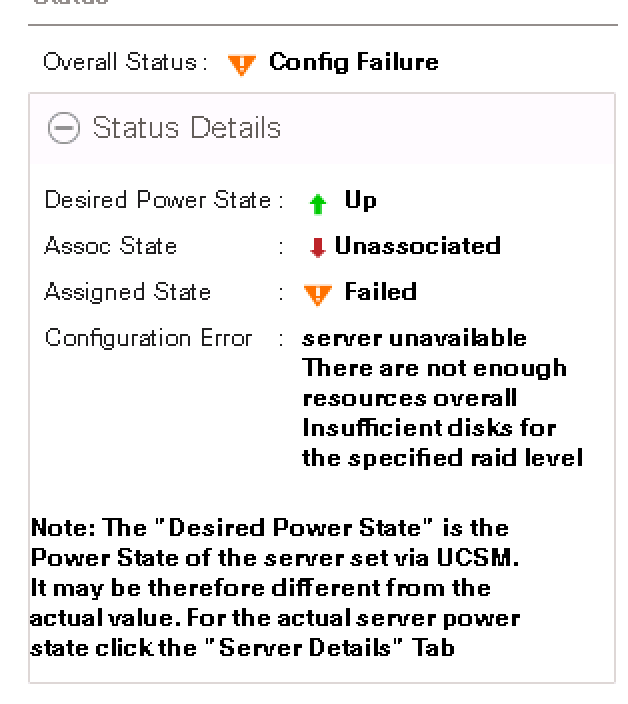

Before continuing, be sure you have completed [stage 1](../).  

# 1. Prereqs

* Python 2.7+ is required
* The build machine could be the same as the web server machine but should be able to access UCSM with a ping.

# 2. Setup

## 2.1 Get Python Setup

RedHat and CentOS should come with python installed by default.  You'll just need to get pip to get the UCS dependencies. 

```
cd /tmp/
wget https://bootstrap.pypa.io/get-pip.py
python get-pip.py
pip install ucsmsdk
```

<div class="alert alert-info">
<b>Proxy Issues?</b> If you are behind a proxy you may need to enter in the proxy information for the git clone to work.  Example:   
<code>
https_proxy=proxy.esl.cisco.com:80 wget https://bootstrap.pypa.io/get-pip.py</code>
You may also need to prepend the other commands with this proxy information. 
</div>


## 2.2 Get the code:

```
yum -y install git
mkdir -p ~/Code
cd ~/Code
git clone https://github.com/ciscoucs/KUBaM.git
cd KUBaM/
```

<div class="alert alert-info">
<b>Proxy Issues?</b> If you are behind a proxy you may need to enter in the proxy information for the git clone to work.  Example:   
<code>
https_proxy=proxy.esl.cisco.com:80 git clone https://github.com/ciscoucs/KUBaM.git
</code>
</div>


# 3. Run the Installation Script

```
cd ~/Code/KUBaM/stage2
./kubeucs.py -o kubeblade admin nbv12345 172.28.224.163
[1] VLAN default
[2] VLAN hx-inband-mgmt
[3] VLAN hx-vmotion
[4] VLAN hx-data
[5] VLAN Docker-Data
[6] VLAN Docker-storage
[7] VLAN hx-storage-data
[8] VLAN vm-network
--------------------------------------------------------------------------------
Please Select a VLAN for the Kubernetes Server to use: 1
Creating Kubernetes MAC Pools
Creating Kubernetes VNIC Templates
Creating Kubernetes LAN connectivity policy
Creating Kube Boot Policy
Creating Kube Local Disk Policy
Creating Kube UUID Pools
Creating Kubernetes Compute Pool
Adding Virtual Media Policy
What is the URL for the Boot ISO image?
(E.g.: http://192.168.2.2/kubam/centos7.2-boot.iso) : http://172.28.225.80/kubam/rh73-boot.iso
You entered: http://172.28.225.80/kubam/rh73-boot.iso
Is this correct? [y/N]: y
Listing available UCS Servers
[1]: Blade 1/slot-3 type UCSB-B200-M3
[2]: Blade 1/slot-5 type UCSB-B200-M3
[3]: Blade 1/slot-6 type UCSB-B200-M3
[4]: Blade 1/slot-7 type UCSB-B200-M3
[5]: Blade 1/slot-8 type UCSB-B200-M3
Please select servers you want to install Kubernetes on separated by commas
(E.g: 2,4,8) :
...
```

Note: The '-o' switch in the above command defines the name of the organization you wish to create in UCSM manager.

At the end of this script, the servers should boot back up and be provisioned with the OS you created and be ready to go. 

## Troubleshooting
If your blade or server displays errors like the below:



<b>"Server unavailable There are not enough resources overall Insufficient disks for the specified raid level"</b> and you know there are enough disks in your server then we need to let UCS know that it's ok to free those disks.  

This is done by going to the blade and [Configuring Local Disk Operations as specified in the Admin Guide](http://www.cisco.com/c/en/us/td/docs/unified_computing/ucs/sw/gui/config/guide/2-2/b_UCSM_GUI_Configuration_Guide_2_2/configuring_storage_profiles.html#task_5325E81B0CD84790817EC6F6644ECD4A).

There are two cases that may be required.  The easiest is to go to:

Equipment Tab > Select the Server > In the work pane select Inventory > Storage > Disks

Select each disk and in the field below select "Set JBOD to Unconfigured Good".  If that line is grayed out, please make sure you actually click on the disk.  Do this for each of the disks to free them up. 

If this is grayed out as well, go to: 

Equipment Tab > Select the Server > In the work pane select Inventory > Storage > LUNS. 

Here you can select an existing LUN and Delete it. 


This can take about 5 minutes for the change to take effect and for the server to eventually associate with the service profile. Looking at the FSM tab on the server can get you more information as to where it is in the process. 


If you get an error saying "Controller Does Not support out of band configuration" for the UCS then you may have a C-Series system with the PCH controller.  


The simple fix here is to create a storage controller definition as part of your storage profile.  


This is a manual step as KUBaM does not currently set this up for you automatically.  

Finally, note there are many ways that storage can be configured including SAN boot that we have been able to compute but requires some manual work that we have not codified.  If you have such environments then you can modify storage profiles or SAN Boots to meet your needs. 

## Tips

If you want to reinstall the servers after installing them, you can wipe them out by ssh'ing into each server and running: 

```
dd if=/dev/zero of=/dev/sda bs=1M count=5
```
This will erase the master boot record.  Note that if you do this, be sure you really want to wipe out the machine.  This will make it so you do not need to change the boot order and can simply reboot the server and it will start the installation process again. 

### Storage Options

KUBaM configures two disks in RAID1.  You may decide  you want more, depending on your hardware.  The easiest way to do this is to modify the Disk Group Policy in UCS.  This will allow you to use more drives and have more options.   

You are now ready to move to [stage 3](https://ciscoucs.github.io/kubam/)


